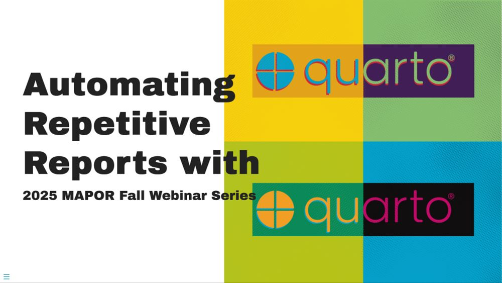

# Automating Repetitive Reports with Quarto

## 2025-10-25 2025 MAPOR Fall Webinar Series

[Link to slides](https://ivelasq-automating-quarto.share.connect.posit.cloud)

## Abstract

Writing reports often means repeating the same tasks: copying results, updating text, and exporting to different formats. Quarto is a technical publishing tool that streamlines this process by combining text, code, and visuals together in one document. Instead of rewriting the same report with minor changes, you can generate multiple versions from a single template. In this webinar, we’ll walk through practical examples, such as client-specific reports and recurring updates, to show how Quarto helps you save time, reduce errors, and deliver consistent, professional reports.

## Resources

### Positron

- [Positron Website](https://positron.posit.co)
- [Positron for RStudio Users: A Gentle Introduction](https://www.youtube.com/watch?v=2fOQzgkxi6g)

### Data

- [TidyTuesday](https://github.com/rfordatascience/tidytuesday)
- [@thedivtagguy's geocoding analysis](https://github.com/thedivtagguy/tidytuesday/tree/master/2024/week-03-polling-places/analysis)

### Quarto

- [Quarto.org](https://www.quarto.org)
- [Awesome Quarto GitHub Repo](https://github.com/mcanouil/awesome-quarto)
- [Intro to Quarto](https://www.youtube.com/watch?v=y6_xMIBKuP4) at R-Ladies St. Louis
- [Chunk options and package options](https://yihui.org/knitr/options/)

### knit_child()

- [Generating dynamic contents in R Markdown and Quarto](https://www.qiushiyan.dev/posts/dynamic-rmd-quarto/) by Qiushi Yan
- [knit_child in a loop - variable as title (StackOverflow)](https://stackoverflow.com/questions/43873345/knit-child-in-a-loop-variable-as-title)
- [How do I knit child documents with parameters into a main RMarkdown document? (StackOverflow)](https://stackoverflow.com/questions/70655915/how-do-i-knit-child-documents-with-parameters-into-a-main-rmarkdown-document)

### Parameterization

- [Parameterized Reporting with Quarto](https://jadeyryan.quarto.pub/rladies-abuja-quarto-params/) by Jadey Ryan at R-Ladies Abuja
